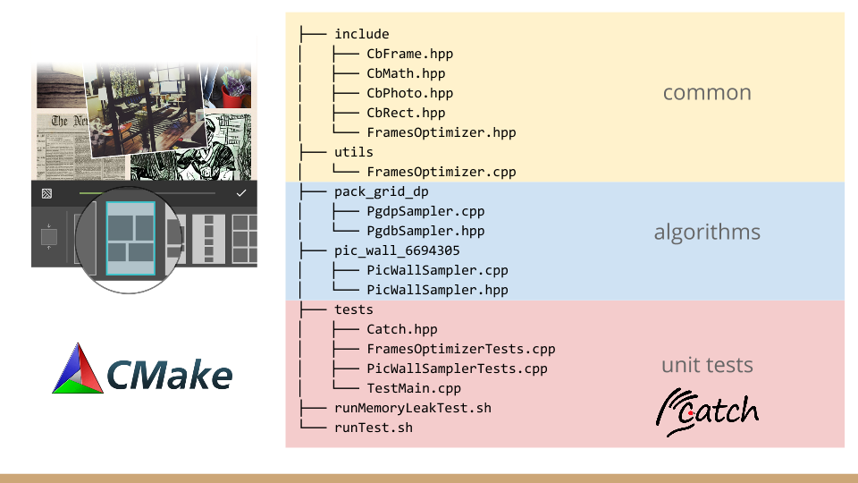

pic-collage-algorithms-lib
==========================

The cross-platform algorithms library for iOS, Android, Windows app development and etc.

The Infrastructure
------------------


The library is designed to solve general algorithm problem including the *grids generator*, *grids optimizer*, *pic-wall algorithm*, *pack-in-grid-dp algorithm* and more. It's a platform indenpent repository and the *bridges* are responsible for translating the data for the separate platforms back and forth. So it uses the *[protobuf](https://github.com/google/protobuf/releases/tag/v3.0.0) (3.0.0)* framework to define the data exchange format and generate respective codes.


Directory Convention
--------------------



We use [CMake](https://cmake.org/) as the build system and [Catch](https://github.com/philsquared/Catch) as the unit-test framework. We also use [Valgrind](http://valgrind.org/) to prevent memory leak.

* The algorithm codes should be stored in separate sub-directories named as detailed as possible and end with the paper number if there's a one. And the unit-tests are all stored in `./tests/` directory.

* The common header files are all stored in the `./include/` directory.

* The protocol header and source files are all stored in the `./protocol` directory.

Because the repo is used by different platforms, **please DON'T put platform dependent codes here.** If you want to use the repo, please use `git subtree`, `git submodule` or create a wrapper instead.

```
├── include
│   ├── GridsGenerator.hpp
│   ├── GridsOptimizer.hpp
│   ├── Grid.hpp
│   ├── Math.hpp                             # Common Header
│   ├── Photo.hpp
│   ├── Rect.hpp
│   └── RectSlot.hpp
├── common
│   ├── GridsGenerator.cpp
│   └── GridsOptimizer.cpp
│                                          -------------------
├── protocol
│   ├── *.proto                              # Common Source
│   ├── *.pb.h
│   └── *.pb.cc
│                                          -------------------
├── algorithm
│   ├── designer
│   │   ├── DesignerSampler.cpp
│   │   └── DesignerSampler.hpp              # Algorithms
│   └── pic_wall_6694305
│       ├── PicWallSampler.cpp
│       ├── PicWallSampler.hpp
│       └── README.md
│                                          -------------------
├── third_party
│   └── google                               # 3rd Party
│       └── protobuf
│           └── *.cc
│                                          -------------------
├── tests
│   ├── Catch.hpp
│   ├── GridsOptimizerTests.cpp
│   ├── PicWallSamplerTests.cpp              # Unit-Tests
│   ├── ProtobufTests.cpp
│   └── TestMain.cpp
│                                          -------------------
├── CMakeLists.txt
├── runClean.sh
├── runCompileProto.sh
├── runCompileTests.sh                       # Build Scripts
├── runMemoryLeakTest.sh
└── runTest.sh
```

Usage
-----

[instruction](doc/instruction.md)

Run Unit-Tests
--------------

The prerequisites are able to be installed by [homebrew](https://github.com/Homebrew/brew/blob/master/share/doc/homebrew/Installation.md) if you're using a Mac system.

#### Prerequisties:
* Have `c++` or `clang` compiler installed. e.g. `brew install llvm`
* Have your shell environment set. e.g.

```bash
export CC=/usr/local/opt/llvm/bin/clang
export CXX=/usr/local/opt/llvm/bin/clang++
```

* Have STL for C++ installed.
* Have `cmake` installed. e.g. `brew install cmake`

#### Commands:
Run command `runTests.sh` to go all unit-tests.

```bash
$> ./runTests.sh
```

Or command `runCompileTests.sh` to build the unit-tests only.

```bash
$> ./runCompileTests.sh
```

If you want to run one of the unit-tests,

```bash
$> ./UnitTest -l             # List all/matching test cases.
$> ./UnitTest $CASE_NAME -s  # Run certain test only.
```

If your IDE complains about the existing cached files, use `runClean.sh` to clean the CMake generated files.

```bash
$> ./runClean.sh
```

Last, if you want to compile the protocol (`*.proto`) files only.

```bash
$> ./runCompileProto.sh
```

> Note: The `protoc` compiler is version of `3.0.0`.

#### Check Memory-Leak:

Run command `runMemoryLeakTest.sh` to go memory-leak report.

```bash
$> ./runMemoryLeakTest.sh
```

Supported Algorightms
---------------------
* [pic_wall_6694305](http://ieeexplore.ieee.org/xpl/login.jsp?tp=&arnumber=6694305&url=http%3A%2F%2Fieeexplore.ieee.org%2Fxpls%2Fabs_all.jsp%3Farnumber%3D6694305)

To Be Included
--------------
* [pack_in_grid_with_dynamic_programming](http://fangel.github.io/packing-images-in-a-grid/)
* [picture_collage_cvpr2006](http://research.microsoft.com/en-us/um/people/jiansun/papers/PictureCollage_CVPR2006.pdf)
* my pre-defined grids.

TODO
----
* Implement text-based UI so that the test could chose what unit-test to be executed.
* Implement UI-testing by adapting to [nodejs](https://nodejs.org/api/addons.html).
